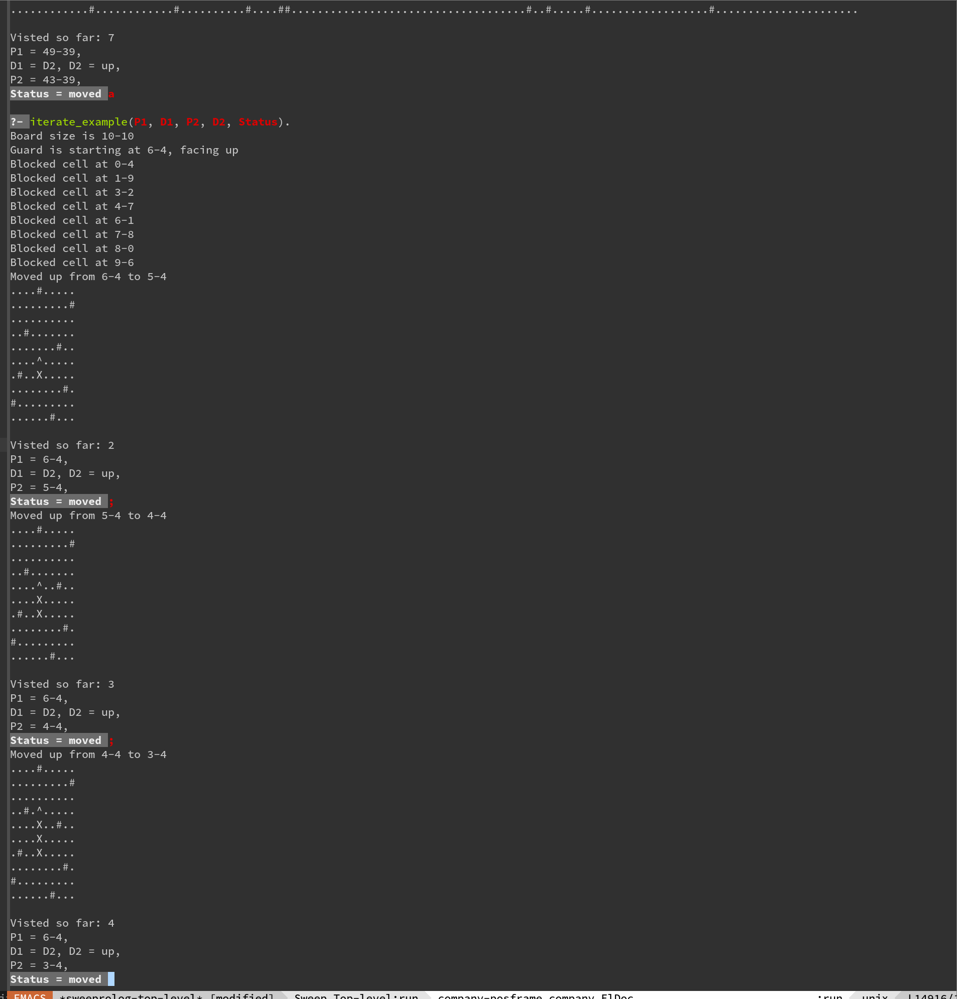

I set it up to have it generate successive answers so you can step thru the board in the REPL and visualize everything
as it happens.

```prolog
init_from_file('day-06-example.txt', P1, D1), iterate(P1, D1, P2, D2, Status), print_board(P2, D2).
```



will solve for all the board state changes.

If you want just the final status and the number of cells visited, you can constrain that query to

```prolog
init_from_file('day-06-example.txt', P1, D1), iterate(P1, D1, _P2, _D2, exited), num_visited(NumVisited).
```

and it will only return the final state change where the board gets exited.

I initially had it read in the board from the a file as a list of lists and then keep track of state by producing new
versions of the board. This ended up being way to slow for the larger actual input so I wrote a new version that just
stores the locations of blocked cells as dynamic `blocked(Position)` rules stored in the Prolog database, and stored the
visited positions as `visted(Position)`; then we just need to do a quick count of the number visited at the end. I could
have used a set for these but I haven't figured out how to use sets in Prolog yet.

On a cool side note I thought the way I came up with for replacing the nth element of a list in Prolog was pretty neat.

```prolog
replace_nth(Index, List, Element, NewList) :-
    same_length(List, NewList),
    length(Before, Index),
    append(Before, [_ | After], List),
    append(Before, [Element | After], NewList).
```
